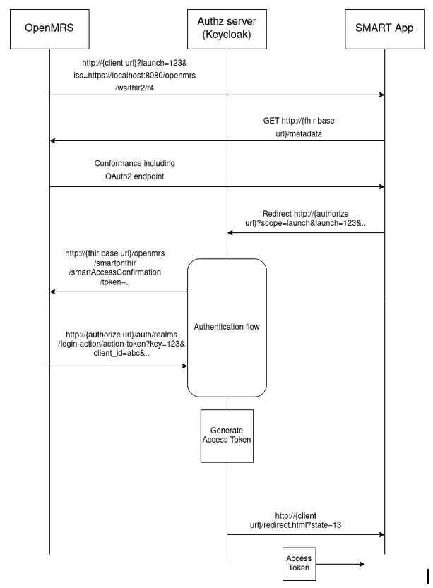

## Demo SMART APP

This repository contains a SMART APP which is based on [JavaScript-Client Library](http://docs.smarthealthit.org/client-js/).

## Authenticationn flow

## Setup 

Ensure you have [node.js and npm](https://docs.npmjs.com/downloading-and-installing-node-js-and-npm) installed locally.

To run the SMART APP locally, Follow the instruction mentioned below:

1.  Make sure you have OpenMRS and Keycloak servers running locally on ports 8080 and 8180 respectively or you can run the [Dockerized Image](https://github.com/theanandankit/openmrs-keycloak-dockerized-setup) also.

2.  Clone the SMART APP repository locally

        git clone https://github.com/theanandankit/Demo-Smart-App.git

3.  Get all dependencies

        npm install

4.  Run the SMART APP locally

        npm start

SMART-APP start running at 9190 port. [launch-standalone.html](https://github.com/theanandankit/Demo-Smart-App/blob/master/launch-standalone.html) is the entry point of SMART APP and contains all metadata.

## SMART LAUNCH

For standalone launch enter the url http://127.0.0.1:9090/launch-standalone.html

For EHR launch go to the Patient profile and select DEMO SMART APP option on patient chart.
